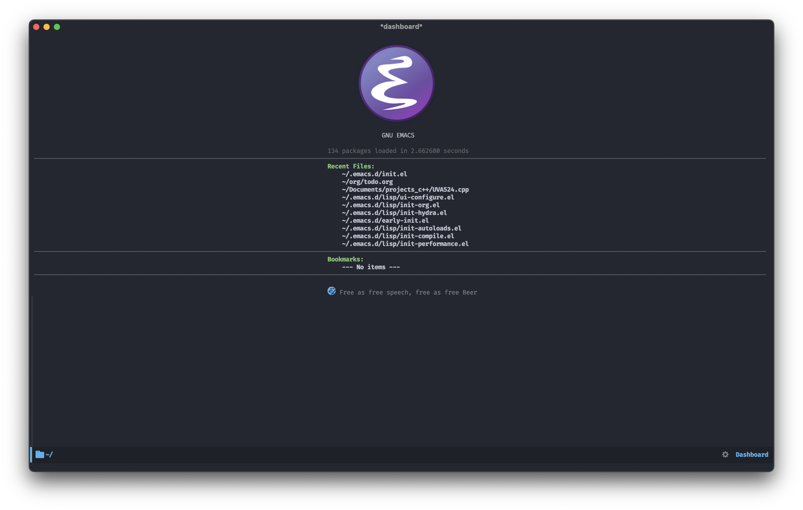
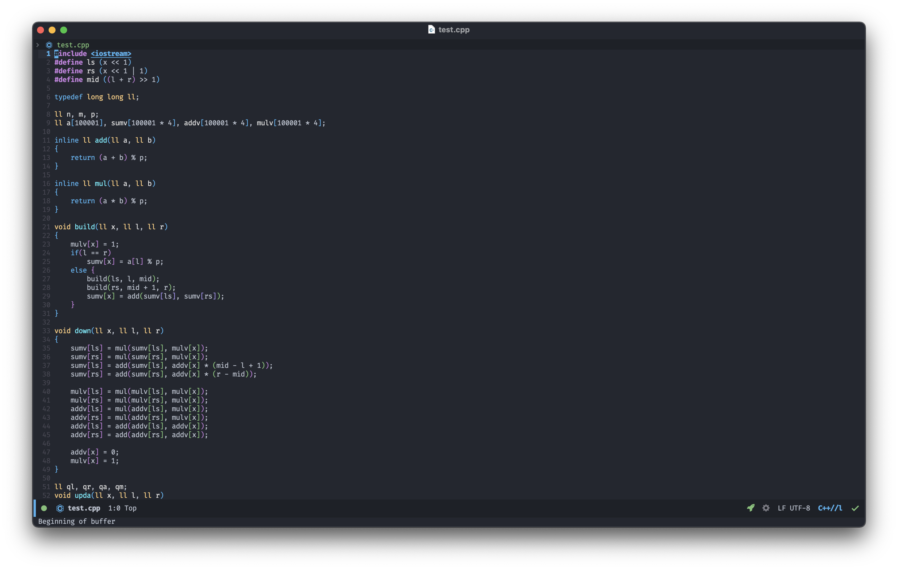

## FLYmacs [](https://github.com/FlyfishO25/.emacs.d/actions?query=workflow%3ACI)

## Introduction

This is an easy-to-use and beautiful Emacs configuration, powered by myself.

## Prerequisites

* [Git](https://git-scm.com/) 2.23+
* [Emacs](https://www.gnu.org/software/emacs/) 27.2+ (**version *28.x* is recommended**, [native-comp](https://www.emacswiki.org/emacs/GccEmacs) is also supported with features), ⚠️Warning: Emacs 29 may not comfort with doom-modeline.
* [ripgrep](https://github.com/BurntSushi/ripgrep) 11.0+
* [clangd](https://clangd.llvm.org)
* [Fira Code Font](https://github.com/tonsky/FiraCode)

## Installation

Just clone this repo to your home directory:
```sh
mv ~/.emacs.d ~/.emacs.d.bak # if you have your own Emacs configuration, then make a backup
git clone https://github.com/Flyfish/.emacs.d ~/.emacs.d

# it is suggested to run the following commands after git clone
cd ~/.emacs.d
git submodule update --init --remote
```

## Minimal configure & troubleshooting
```sh
emacs -Q --l ~/.emacs.d/init-mini.el # minimal startup, more features included
emacs -Q --l ~/.emacs.d/init-down.el # just for troubleshooting, use when emacs down completely
```

## Update
```elisp
(update-config) ; update configures
(update-packages) ; update packages
```

## Credits

* [Centaur Emacs](https://github.com/seagle0128/.emacs.d)
* [Doom Emacs](https://github.com/hlissner/doom-emacs)

## Screenshots



