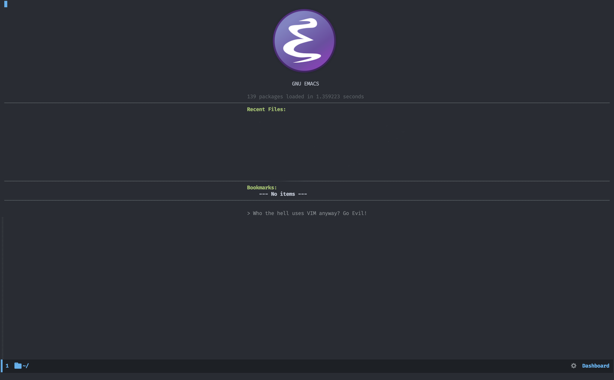
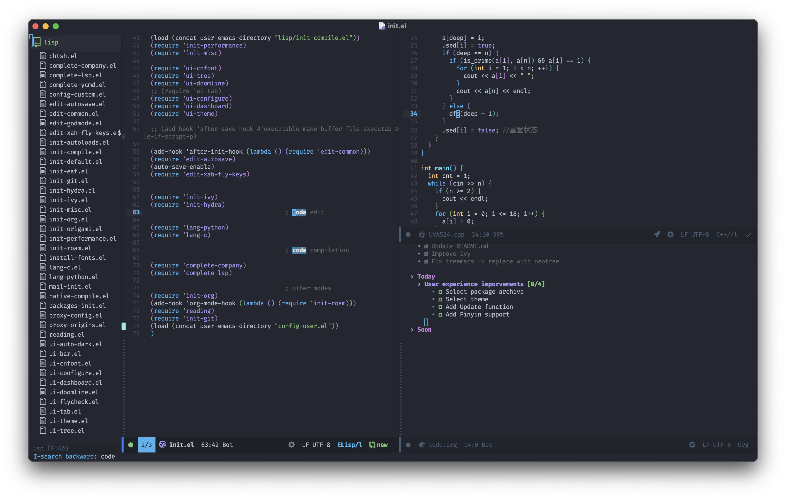

# FLYMACS
An easy-to-use, beautiful Emacs configure.

[](https://github.com/FlyfishO25/.emacs.d/actions?query=workflow%3ACI)

**Content**

# Screenshot




# Prerequisites

+ Git 2.23+
+ Emacs 27.1+ (*27.2 is recommended*, or [native-comp](https://www.emacswiki.org/emacs/GccEmacs)).
+ [ripgrep](https://github.com/BurntSushi/ripgrep) 11.0+
+ [clangd](https://clangd.llvm.org)
+ [Fira Code Font](https://github.com/tonsky/FiraCode)

# Install

```sh
mv ~/.emacs.d ~/.emacs.d.bak
git clone https://github.com/Flyfish/.emacs.d ~/.emacs.d
```

# Credit
[Centaur Emacs](https://github.com/seagle0128/.emacs.d)

[Doom Emacs](https://github.com/hlissner/doom-emacs)
